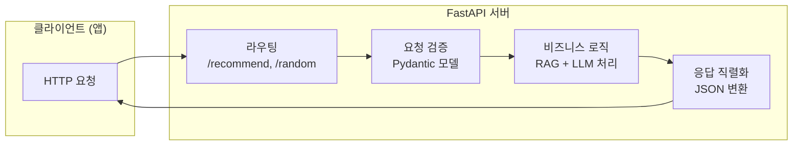
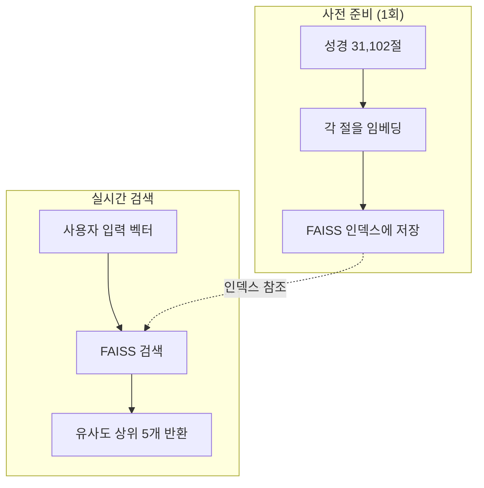
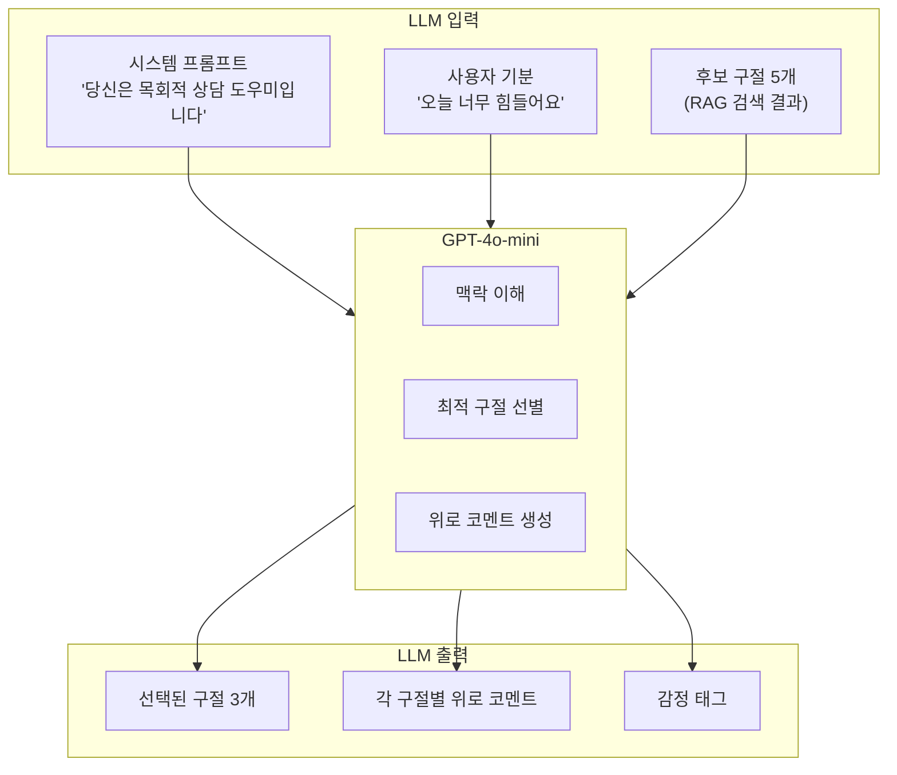
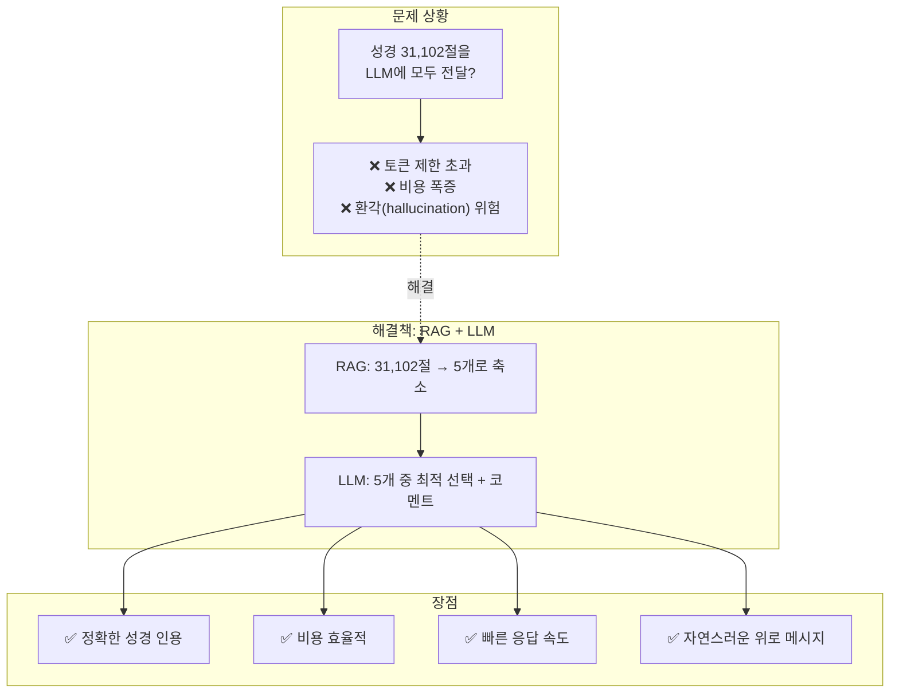
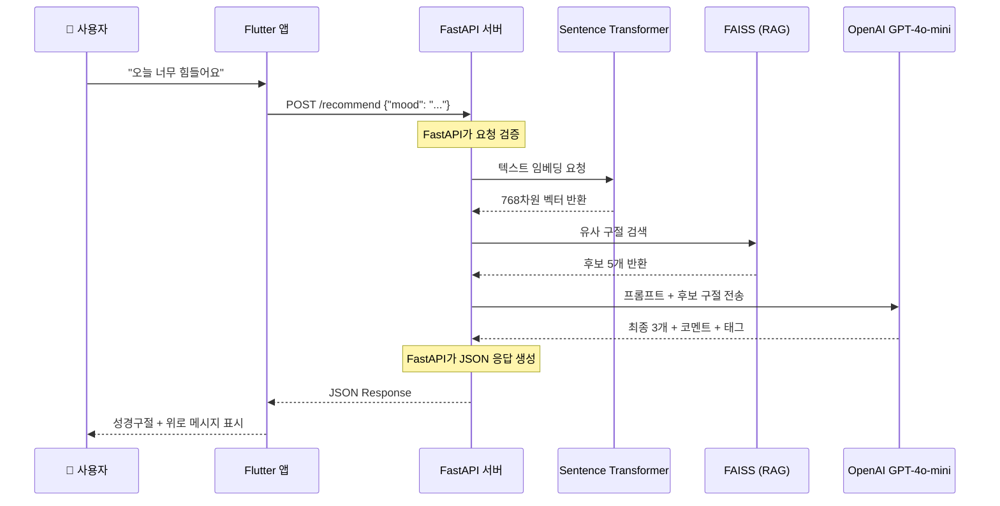

# With God - RAG + LLM 성경구절 추천 시스템

## 전체 시스템 개요

이 서비스는 사용자가 **자신의 기분이나 고민을 입력**하면, **AI가 적절한 성경 구절을 찾아주고 위로의 메시지를 생성**해주는 시스템입니다.

### 핵심 기술 스택

| 구분 | 기술 | 역할 |
|------|------|------|
| **Backend Framework** | FastAPI | API 서버, 요청/응답 처리 |
| **RAG (검색)** | FAISS + Sentence Transformer | 의미적으로 유사한 성경구절 검색 |
| **LLM (생성)** | OpenAI GPT-4o-mini | 위로 코멘트 생성 |
| **데이터** | KR1910 (개역한글판) | 한국어 성경 전체 31,102절 |

---

## 전체 처리 흐름도

> **Notion 사용법**: 아래 코드 블록을 `/mermaid` 블록에 붙여넣으면 다이어그램으로 렌더링됩니다.

```mermaid
flowchart TD
    subgraph APP["📱 사용자 앱 (Flutter)"]
        A1[사용자가 고민 입력<br/>"오늘 너무 힘들어요"]
    end

    subgraph FASTAPI["⚡ FastAPI 백엔드 서버"]
        B1["1️⃣ 요청 수신 및 검증<br/>(FastAPI가 JSON 파싱)"]
        B2["2️⃣ 텍스트 임베딩<br/>(Sentence Transformer)"]
        B3["3️⃣ RAG 검색<br/>(FAISS 벡터 DB)"]
        B4["4️⃣ LLM 호출<br/>(OpenAI GPT-4o-mini)"]
        B5["5️⃣ 응답 생성 및 반환<br/>(FastAPI가 JSON 응답)"]
    end

    subgraph RESULT["📖 최종 결과"]
        C1["성경구절 3개<br/>+ 위로 코멘트<br/>+ 감정 태그"]
    end

    A1 -->|"POST /recommend<br/>{mood: '...'}"| B1
    B1 --> B2
    B2 -->|"768차원 벡터"| B3
    B3 -->|"후보 5개"| B4
    B4 -->|"최종 3개 선별"| B5
    B5 -->|"JSON Response"| C1
    C1 --> APP
```

---

## 각 기술의 역할 상세 설명

### 1. FastAPI - 백엔드 프레임워크



**FastAPI란?**
- Python으로 만든 **고성능 웹 API 프레임워크**
- Flask보다 빠르고, 자동으로 API 문서(Swagger) 생성

**이 프로젝트에서 FastAPI가 하는 일:**

| 역할 | 설명 | 코드 위치 |
|------|------|-----------|
| **API 엔드포인트 정의** | `/recommend`, `/random` 경로 설정 | `@app.post("/recommend")` |
| **요청 데이터 검증** | JSON 형식이 올바른지 자동 검사 | `class RecommendIn(BaseModel)` |
| **응답 형식 정의** | 응답 JSON 구조 명세 | `class RecommendOut(BaseModel)` |
| **Swagger 문서 자동 생성** | API 테스트 페이지 제공 | `https://mincha.co.kr/docs` |
| **에러 처리** | 잘못된 요청 시 422 에러 반환 | 자동 처리 |

**FastAPI가 없다면?**
- 직접 HTTP 파싱, JSON 변환, 에러 처리 등을 모두 구현해야 함
- API 문서를 수동으로 작성해야 함

---

### 2. Sentence Transformer - 텍스트 임베딩


**임베딩(Embedding)이란?**
- 텍스트를 **숫자 벡터로 변환**하는 과정
- 의미가 비슷한 문장은 **비슷한 벡터**를 가짐

**예시:**
```
"힘들어요"     → [0.12, -0.34, 0.56, ...]
"지쳤어요"     → [0.11, -0.33, 0.55, ...]  ← 비슷한 벡터!
"기뻐요"       → [-0.45, 0.67, -0.23, ...] ← 다른 벡터
```

**사용 모델: `intfloat/multilingual-e5-base`**
- 다국어 지원 (한국어 성능 우수)
- 768차원 벡터 출력
- MIT 라이선스 (무료 사용 가능)

---

### 3. FAISS - 벡터 검색 엔진 (RAG의 핵심)



**FAISS란?**
- Facebook AI Research에서 개발한 **벡터 유사도 검색 라이브러리**
- 수백만 개의 벡터 중에서 가장 유사한 것을 **밀리초 단위**로 검색

**RAG (Retrieval-Augmented Generation)란?**
- **검색(Retrieval)** + **생성(Generation)** 결합
- 먼저 관련 정보를 **검색**한 후, LLM이 **생성**

**이 프로젝트에서 FAISS/RAG가 하는 일:**

| 단계 | 설명 |
|------|------|
| 1. 사전 인덱싱 | 성경 31,102절을 모두 벡터화하여 FAISS에 저장 |
| 2. 쿼리 변환 | 사용자 입력을 벡터로 변환 |
| 3. 유사도 검색 | 코사인 유사도 기반 상위 5개 구절 검색 |
| 4. 후보 반환 | LLM에게 전달할 후보 구절 목록 생성 |

---

### 4. OpenAI GPT-4o-mini - LLM (대규모 언어 모델)



**LLM이 하는 일:**

| 역할 | 설명 |
|------|------|
| **구절 선별** | RAG가 찾은 5개 중 사용자 상황에 가장 적합한 3개 선택 |
| **코멘트 생성** | 각 구절에 대해 따뜻하고 공감적인 위로 메시지 작성 |
| **태그 부여** | 감정 태그 추가 (두려움, 걱정, 소망, 감사 등) |
| **언어 품질** | 자연스럽고 문법적으로 올바른 한국어 생성 |

**프롬프트 설계 (요약):**
```
역할: 한국어만 사용하는 기독교 상담 도우미
규칙:
- 반드시 한국어만 사용
- comment는 3-4문장으로 작성
- 각 구절에 감정 태그 추가
- JSON 배열로만 출력

사용자 기분: "오늘 너무 힘들어요"
후보 구절: [RAG 검색 결과 5개]
요청: 가장 적절한 3개 선택 + 코멘트 작성
```

---

## RAG + LLM 조합이 필요한 이유



### 비교표

| 방식 | 장점 | 단점 |
|------|------|------|
| **RAG만** | 빠른 검색, 정확한 인용 | 위로 코멘트 생성 불가 |
| **LLM만** | 자연스러운 문장 생성 | 성경 인용 부정확, 비용 높음 |
| **RAG + LLM** | 정확한 인용 + 자연스러운 코멘트 | 구현 복잡도 증가 (하지만 가치 있음) |

---

## 데이터 흐름 전체 요약



---

## API 상세 명세

### POST /recommend

**요청:**
```json
{
  "mood": "오늘 너무 힘들어요"
}
```

**응답:**
```json
{
  "mood": "오늘 너무 힘들어요",
  "model": "gpt-4o-mini",
  "style": "long",
  "results": [
    {
      "ref": "시편 23:1",
      "text": "여호와는 나의 목자시니 내게 부족함이 없으리로다.",
      "comment": "지금은 불안을 혼자 견디지 말고, 하루를 맡기며 한 걸음씩 가도 괜찮습니다.",
      "tag": "두려움"
    },
    {
      "ref": "빌립보서 4:6",
      "text": "아무것도 염려하지 말고 다만 모든 일에 기도와 간구로...",
      "comment": "걱정이 올라올 때마다 한 문장 기도로 바꿔보면 마음의 소음이 조금씩 잦아듭니다.",
      "tag": "걱정"
    },
    {
      "ref": "이사야 41:10",
      "text": "두려워 말라 내가 너와 함께 함이니라...",
      "comment": "혼자라는 느낌이 들 때, 이 약속을 기억해주세요.",
      "tag": "소망"
    }
  ]
}
```

### GET /random

**요청:** 없음 (단순 GET)

**응답:**
```json
{
  "ref": "잠언 3:5",
  "text": "너는 마음을 다하여 여호와를 의뢰하고 네 명철을 의지하지 말라"
}
```

---

## 파일 구조

```
with-god-rag-develop/
├── app.py              # FastAPI 메인 서버 (API 엔드포인트)
├── index.py            # 성경 데이터 임베딩 및 FAISS 인덱스 생성
├── prepare.py          # 원본 성경 데이터 전처리
└── data/
    ├── verses.csv           # 성경 원본 텍스트
    ├── verses.faiss         # FAISS 벡터 인덱스
    ├── verses_meta.parquet  # 메타데이터
    └── verses.npy           # 임베딩 벡터 배열
```

---

## 세미나 핵심 포인트

1. **FastAPI** = 웹 서버의 뼈대. 요청을 받고 응답을 보내는 역할
2. **RAG** = 방대한 데이터에서 관련 정보를 빠르게 검색
3. **LLM** = 검색된 정보를 바탕으로 자연스러운 문장 생성
4. **조합의 시너지** = 정확성(RAG) + 창의성(LLM) = 신뢰할 수 있는 AI 서비스

---

## Notion에서 Mermaid 다이어그램 사용법

1. Notion 페이지에서 `/mermaid` 입력
2. Mermaid 블록 선택
3. 위 코드 블록의 내용을 붙여넣기
4. 자동으로 다이어그램 렌더링됨

> **팁**: Notion이 Mermaid를 지원하지 않는 경우, [Mermaid Live Editor](https://mermaid.live/)에서 이미지로 내보내기 가능
