# 신과함께 (WithGod) 풀스택 세미나 자료

---

# Part 1: 프로젝트 소개

## 전체 시스템 개요

**신과함께**는 사용자가 **자신의 기분이나 고민을 입력**하면, **AI가 적절한 성경 구절을 찾아주고 위로의 메시지를 생성**해주는 시스템입니다.

### 핵심 기술 스택

| 구분 | 기술 | 역할 |
| --- | --- | --- |
| **Mobile App** | React Native + Expo | iOS/Android 크로스플랫폼 앱 |
| **Backend Framework** | FastAPI | API 서버, 요청/응답 처리 |
| **RAG (검색)** | FAISS + Sentence Transformer | 의미적으로 유사한 성경구절 검색 |
| **LLM (생성)** | OpenAI GPT-4o-mini | 위로 코멘트 생성 |
| **데이터** | KR1910 (개역한글판) | 한국어 성경 전체 31,102절 |

---

## 전체 처리 흐름도

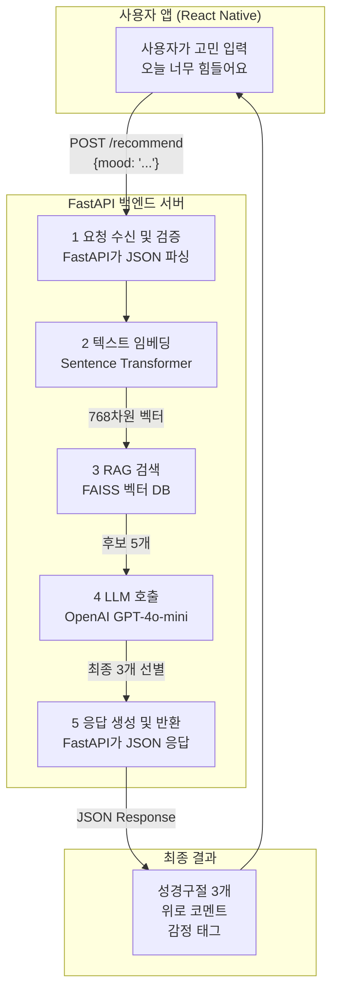

---

# Part 2: Backend (RAG + LLM)

## 1. 각 기술의 역할 상세 설명

### 1.1 FastAPI - 백엔드 프레임워크

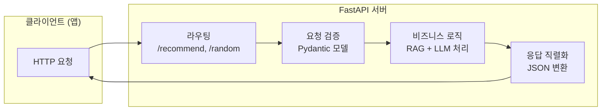

**FastAPI란?**
- Python으로 만든 **고성능 웹 API 프레임워크**
- Flask보다 빠르고, 자동으로 API 문서(Swagger) 생성

**이 프로젝트에서 FastAPI가 하는 일:**

| 역할 | 설명 | 코드 위치 |
|------|------|-----------|
| **API 엔드포인트 정의** | `/recommend`, `/random` 경로 설정 | `@app.post("/recommend")` |
| **요청 데이터 검증** | JSON 형식이 올바른지 자동 검사 | `class RecommendIn(BaseModel)` |
| **응답 형식 정의** | 응답 JSON 구조 명세 | `class RecommendOut(BaseModel)` |
| **Swagger 문서 자동 생성** | API 테스트 페이지 제공 | `https://mincha.co.kr/docs` |
| **에러 처리** | 잘못된 요청 시 422 에러 반환 | 자동 처리 |

**FastAPI가 없다면?**
- 직접 HTTP 파싱, JSON 변환, 에러 처리 등을 모두 구현해야 함
- API 문서를 수동으로 작성해야 함

---

### 1.2 Sentence Transformer - 텍스트 임베딩


**임베딩(Embedding)이란?**
- 텍스트를 **숫자 벡터로 변환**하는 과정
- 의미가 비슷한 문장은 **비슷한 벡터**를 가짐

**예시:**
```
"힘들어요"     → [0.12, -0.34, 0.56, ...]
"지쳤어요"     → [0.11, -0.33, 0.55, ...]  ← 비슷한 벡터!
"기뻐요"       → [-0.45, 0.67, -0.23, ...] ← 다른 벡터
```

**사용 모델: `intfloat/multilingual-e5-base`**
- 다국어 지원 (한국어 성능 우수)
- 768차원 벡터 출력
- MIT 라이선스 (무료 사용 가능)

---

### 1.3 FAISS - 벡터 검색 엔진 (RAG의 핵심)

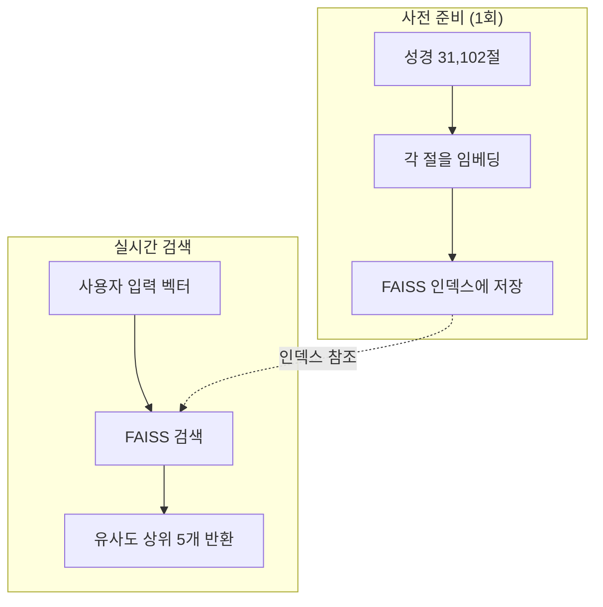

**FAISS란?**
- Facebook AI Research에서 개발한 **벡터 유사도 검색 라이브러리**
- 수백만 개의 벡터 중에서 가장 유사한 것을 **밀리초 단위**로 검색

**RAG (Retrieval-Augmented Generation)란?**
- **검색(Retrieval)** + **생성(Generation)** 결합
- 먼저 관련 정보를 **검색**한 후, LLM이 **생성**

**이 프로젝트에서 FAISS/RAG가 하는 일:**

| 단계 | 설명 |
|------|------|
| 1. 사전 인덱싱 | 성경 31,102절을 모두 벡터화하여 FAISS에 저장 |
| 2. 쿼리 변환 | 사용자 입력을 벡터로 변환 |
| 3. 유사도 검색 | 코사인 유사도 기반 상위 5개 구절 검색 |
| 4. 후보 반환 | LLM에게 전달할 후보 구절 목록 생성 |

---

### 1.4 OpenAI GPT-4o-mini - LLM (대규모 언어 모델)

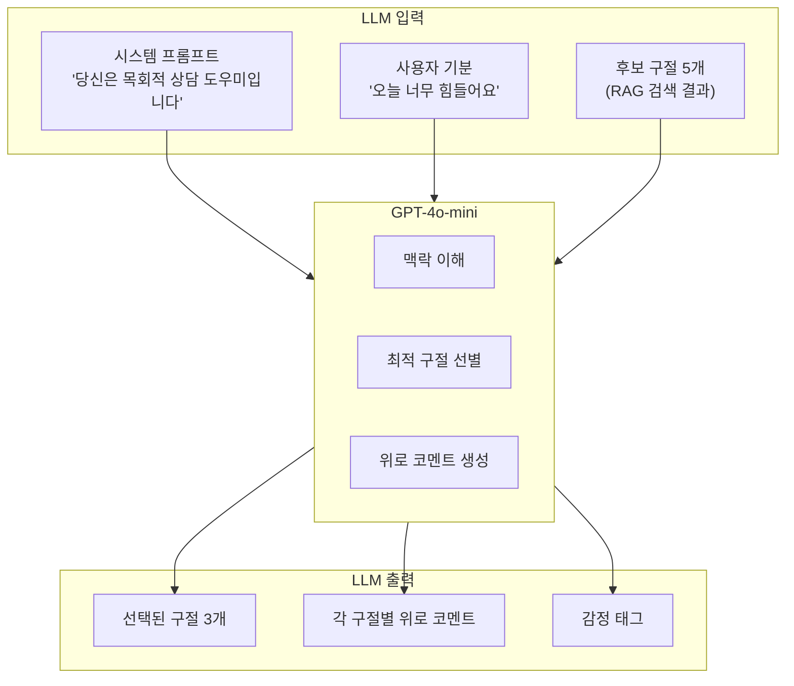

**LLM이 하는 일:**

| 역할 | 설명 |
|------|------|
| **구절 선별** | RAG가 찾은 5개 중 사용자 상황에 가장 적합한 3개 선택 |
| **코멘트 생성** | 각 구절에 대해 따뜻하고 공감적인 위로 메시지 작성 |
| **태그 부여** | 감정 태그 추가 (두려움, 걱정, 소망, 감사 등) |
| **언어 품질** | 자연스럽고 문법적으로 올바른 한국어 생성 |

**프롬프트 설계 (요약):**
```
역할: 한국어만 사용하는 기독교 상담 도우미
규칙:
- 반드시 한국어만 사용
- comment는 3-4문장으로 작성
- 각 구절에 감정 태그 추가
- JSON 배열로만 출력

사용자 기분: "오늘 너무 힘들어요"
후보 구절: [RAG 검색 결과 5개]
요청: 가장 적절한 3개 선택 + 코멘트 작성
```

---

## 2. RAG + LLM 조합이 필요한 이유

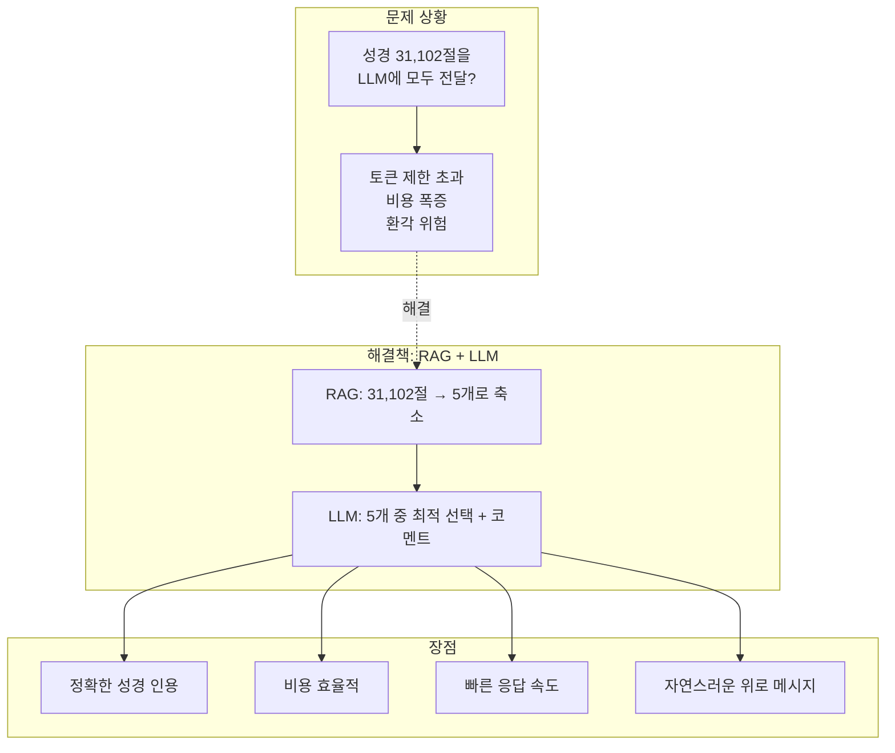

### 비교표

| 방식 | 장점 | 단점 |
|------|------|------|
| **RAG만** | 빠른 검색, 정확한 인용 | 위로 코멘트 생성 불가 |
| **LLM만** | 자연스러운 문장 생성 | 성경 인용 부정확, 비용 높음 |
| **RAG + LLM** | 정확한 인용 + 자연스러운 코멘트 | 구현 복잡도 증가 (하지만 가치 있음) |

---

## 3. 데이터 흐름 전체 요약

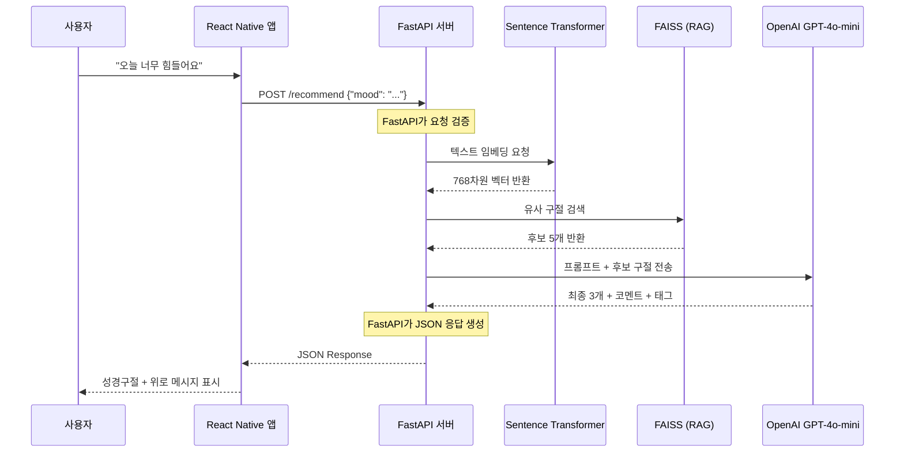

---

## 4. API 상세 명세

### POST /recommend

**요청:**
```json
{
  "mood": "오늘 너무 힘들어요"
}
```

**응답:**
```json
{
  "mood": "오늘 너무 힘들어요",
  "model": "gpt-4o-mini",
  "style": "long",
  "results": [
    {
      "ref": "시편 23:1",
      "text": "여호와는 나의 목자시니 내게 부족함이 없으리로다.",
      "comment": "지금은 불안을 혼자 견디지 말고, 하루를 맡기며 한 걸음씩 가도 괜찮습니다.",
      "tag": "두려움"
    },
    {
      "ref": "빌립보서 4:6",
      "text": "아무것도 염려하지 말고 다만 모든 일에 기도와 간구로...",
      "comment": "걱정이 올라올 때마다 한 문장 기도로 바꿔보면 마음의 소음이 조금씩 잦아듭니다.",
      "tag": "걱정"
    },
    {
      "ref": "이사야 41:10",
      "text": "두려워 말라 내가 너와 함께 함이니라...",
      "comment": "혼자라는 느낌이 들 때, 이 약속을 기억해주세요.",
      "tag": "소망"
    }
  ]
}
```

### GET /random

**요청:** 없음 (단순 GET)

**응답:**
```json
{
  "ref": "잠언 3:5",
  "text": "너는 마음을 다하여 여호와를 의뢰하고 네 명철을 의지하지 말라"
}
```

---

## 5. 백엔드 파일 구조

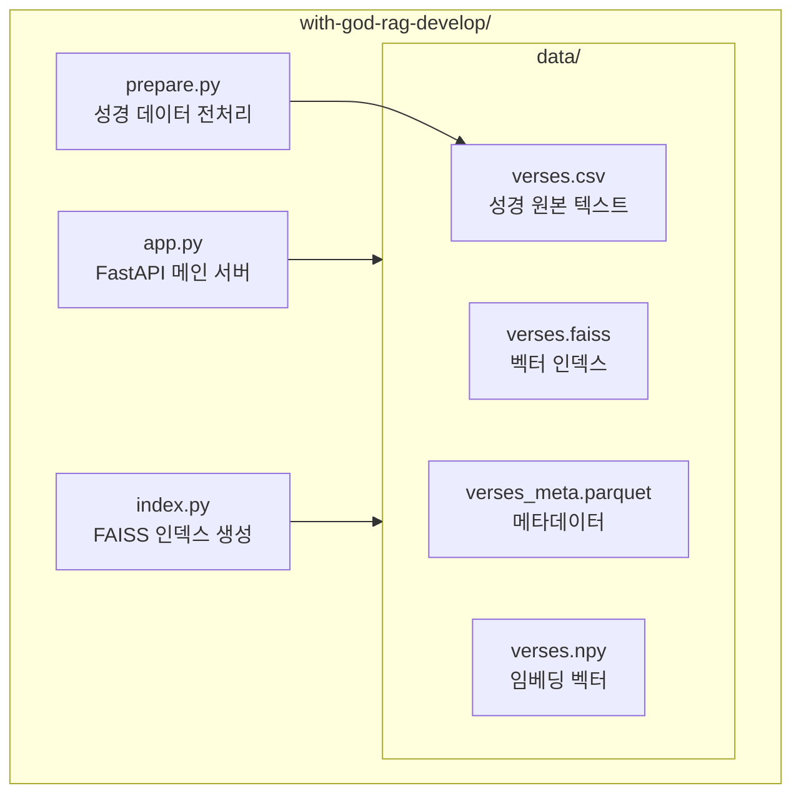

---

## 6. 구현 스펙 요약

### 임베딩 및 검색 모델

| 항목 | 스펙 |
|------|------|
| **임베딩 모델** | SentenceTransformer (intfloat/multilingual-e5-base) |
| **벡터 검색 엔진** | FAISS (IndexFlatIP) |
| **유사도 방식** | 코사인 유사도 (정규화 + Inner Product) |

### 생성 모델 (LLM)

| 항목 | 스펙 |
|------|------|
| **플랫폼** | OpenAI API |
| **모델명** | gpt-4o-mini |
| **temperature** | 0.4 (과도한 창작 억제) |
| **response_format** | json_object (구조화 응답 강제) |

### 데이터셋

| 항목 | 스펙 |
|------|------|
| **버전** | Korean Revised Version 1910 (KR1910) |
| **청킹 단위** | 성경 한 절(Verse) |
| **총 규모** | 약 31,000 절 |

### RAG 파라미터 설정

| 항목 | 값 |
|------|-----|
| **Top-K 검색 개수** | 5 |
| **최종 선택 개수** | 3 |
| **코멘트 스타일** | short / medium / long |

---

## 7. 세미나 핵심 포인트

1. **FastAPI** = 웹 서버의 뼈대. 요청을 받고 응답을 보내는 역할
2. **RAG** = 방대한 데이터에서 관련 정보를 빠르게 검색
3. **LLM** = 검색된 정보를 바탕으로 자연스러운 문장 생성
4. **조합의 시너지** = 정확성(RAG) + 창의성(LLM) = 신뢰할 수 있는 AI 서비스

---

## 8. 연구적 의의

### 기술적 의의

- **RAG 구조를 통한 LLM 할루시네이션 완화 검증**
    - FAISS 기반 벡터 검색으로 성경 본문을 선제적으로 확보하고, LLM 프롬프트의 근거(context)로 주입
    - LLM 단독 생성 방식 대비 **근거 없는 응답(hallucination) 발생 가능성을 구조적으로 감소**

- **임베딩 기반 의미 검색의 도메인 적용 가능성 검증**
    - 키워드 매칭이 아닌 **SentenceTransformer 기반 의미 임베딩 검색** 적용

- **경량 벡터 검색 아키텍처 설계 및 구현**
    - 외부 Vector DB 서버 없이 **FAISS 기반 파일형 인덱스** 사용
    - 소규모~중규모 도메인 데이터(약 3만 절)에 적합한 **경량·저비용 RAG 아키텍처**

---

# Part 3: Frontend (React Native)

## 1. 프론트엔드 기술 스택

### 사용 기술

| 분류 | 기술 | 버전 | 역할 |
|------|------|------|------|
| **Framework** | React Native | 0.81.5 | 크로스플랫폼 UI |
| **Platform** | Expo | 54 | 빌드/배포/OTA |
| **Language** | TypeScript | 5.9 | 타입 안정성 |
| **Routing** | Expo Router | 6.0 | 파일 기반 라우팅 |
| **서버 상태** | React Query | 5.90 | API 캐싱/동기화 |
| **클라이언트 상태** | Zustand | 5.0 | 전역 상태 관리 |
| **API 통신** | Axios | 1.13 | HTTP 클라이언트 |
| **데이터 검증** | Zod | 4.2 | 런타임 타입 검증 |

---

## 2. 아키텍처: Feature-based Layered Architecture

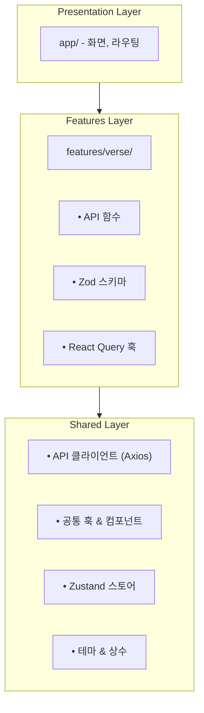

### 폴더 구조

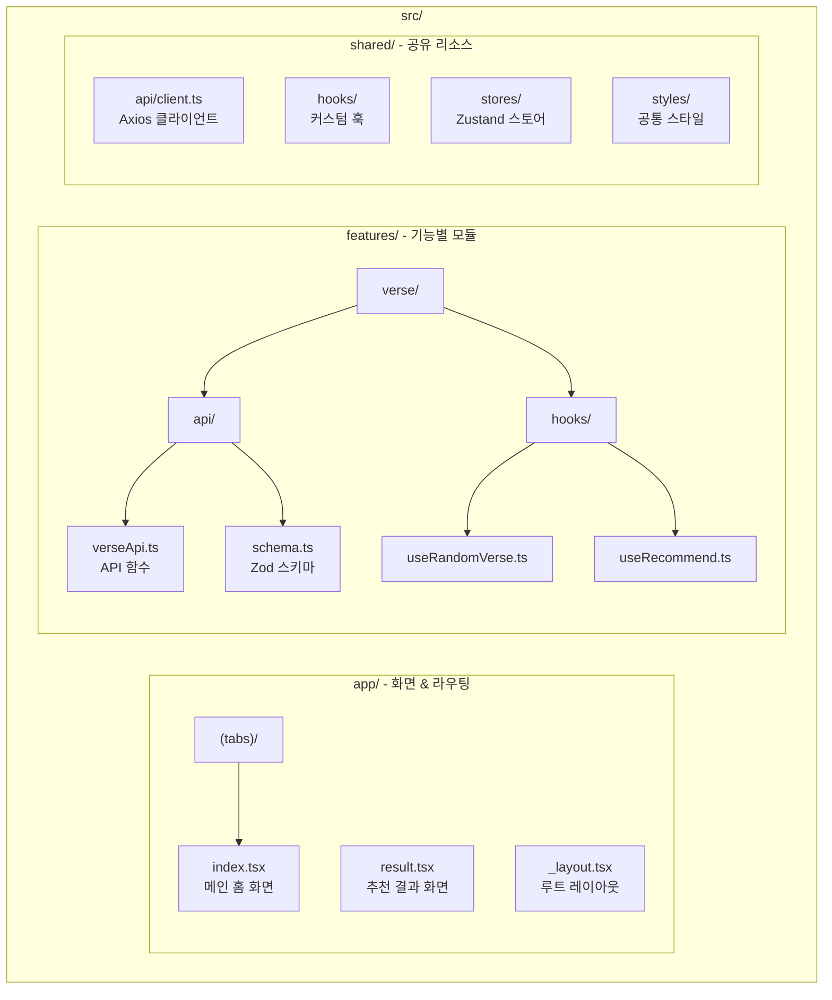

---

## 3. React Hooks - React Native의 핵심

### Hooks란?

> 함수형 컴포넌트에서 상태와 생명주기를 다루는 함수

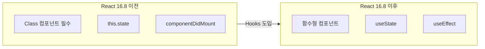

### 프로젝트에서 사용한 Hooks

| 분류 | 훅 | 용도 |
|------|-----|------|
| **React 기본** | useState, useEffect, useMemo, useCallback | 상태, 효과, 최적화 |
| **React Query** | useQuery, useMutation, useQueryClient | 서버 상태 관리 |
| **Expo Router** | useRouter, useLocalSearchParams | 화면 이동, 파라미터 |
| **SafeArea** | useSafeAreaInsets | 노치/홈바 영역 처리 |
| **커스텀** | useKeyboardVisible, useSafeAreaPadding | 비즈니스 로직 추상화 |

### 핵심 4가지 React Hooks

#### 1. useState - 상태 관리
```typescript
const [message, setMessage] = useState("");

// 사용자 입력 저장
<TextInput value={message} onChangeText={setMessage} />
```

#### 2. useEffect - 사이드 이펙트
```typescript
useEffect(() => {
  // 컴포넌트 마운트 시 실행
  return () => {
    // 클린업 (언마운트 시)
  };
}, [dependencies]);
```

#### 3. useMemo - 값 메모이제이션
```typescript
// message가 변경될 때만 재계산
const trimmedMessage = useMemo(() => message.trim(), [message]);
```

#### 4. useCallback - 함수 메모이제이션
```typescript
// 불필요한 함수 재생성 방지
const handleSend = useCallback(() => {
  router.push({ pathname: "/result", params: { mood } });
}, [router, mood]);
```

---

## 4. 상태 관리: React Query + Zustand

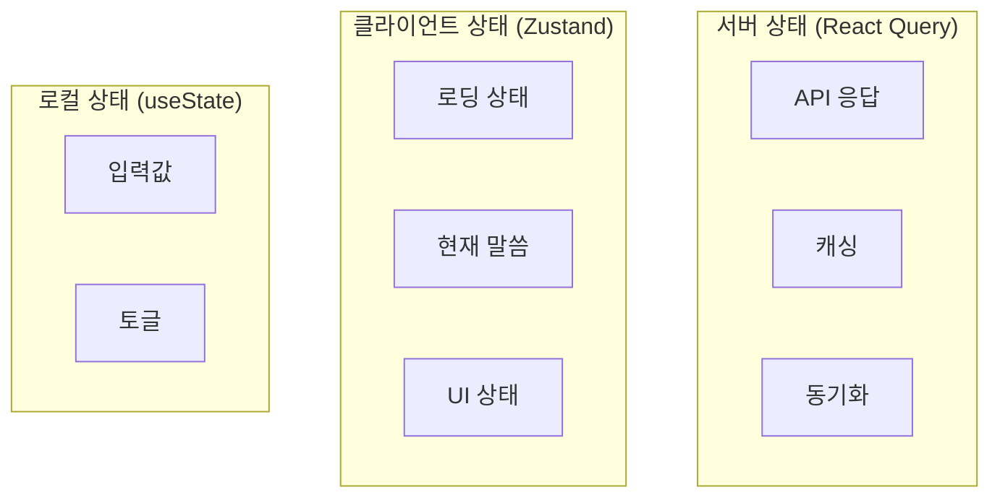

### React Query 사용

```typescript
// 조회 (useQuery)
export function useRandomVerse() {
  return useQuery({
    queryKey: verseKeys.random(),
    queryFn: verseApi.getRandomVerse,
    enabled: false,  // 수동 fetch
  });
}

// 변경 (useMutation)
export function useRecommend() {
  const queryClient = useQueryClient();

  return useMutation({
    mutationFn: (input: RecommendIn) => verseApi.getRecommendation(input),
    onSuccess: (data, variables) => {
      queryClient.setQueryData(verseKeys.recommend(variables.mood), data);
    },
  });
}
```

### Zustand 스토어

```typescript
export const useAppStore = create<AppState>((set) => ({
  currentVerse: null,
  recommendations: [],
  isLoading: false,

  setCurrentVerse: (verse) => set({ currentVerse: verse }),
  setRecommendations: (items) => set({ recommendations: items }),
  setLoading: (loading) => set({ isLoading: loading }),
}));
```

---

## 5. Zod - 런타임 타입 검증

### 문제 상황

```
TypeScript의 한계:
- 컴파일 타임에만 타입 검사
- 런타임에서 API 응답이 예상과 다르면?
- → 앱 크래시 가능!
```

### 해결책: Zod 스키마

```typescript
// 스키마 정의
export const RecommendItemSchema = z.object({
  ref: z.string(),
  text: z.string(),
  comment: z.string().optional(),
  tag: z.string().optional(),
});

export const RecommendOutSchema = z.object({
  mood: z.string(),
  model: z.string().optional(),
  results: z.array(RecommendItemSchema),
  candidates: z.array(VerseCandidateSchema).nullable().optional(),
});

// 자동 타입 추론
export type RecommendOut = z.infer<typeof RecommendOutSchema>;

// API 응답 검증
const data = RecommendOutSchema.parse(apiResponse);
```

### 실제 해결 사례

```
문제: API가 candidates: null 반환
     → Zod 파싱 실패 → 앱 에러

해결: .nullable().optional() 추가
     candidates: z.array(...).nullable().optional()
```

---

## 6. 커스텀 훅 - 플랫폼 추상화

### useKeyboardVisible

```typescript
export function useKeyboardVisible() {
  const [isVisible, setIsVisible] = useState(false);

  useEffect(() => {
    // iOS: keyboardWillShow / Android: keyboardDidShow
    const showEvent = Platform.OS === "ios"
      ? "keyboardWillShow"
      : "keyboardDidShow";

    const subscription = Keyboard.addListener(showEvent, () => {
      setIsVisible(true);
    });

    return () => subscription.remove();
  }, []);

  return isVisible;
}
```

### useSafeAreaPadding

```typescript
export function useSafeAreaPadding() {
  const insets = useSafeAreaInsets();

  const headerPaddingTop = useMemo(() => {
    return Platform.OS === "android"
      ? (StatusBar.currentHeight ?? 0) + 12
      : insets.top + 12;
  }, [insets.top]);

  return { insets, headerPaddingTop };
}
```

---

## 7. 플랫폼별 처리 (iOS / Android)

```typescript
// iOS: KeyboardAvoidingView 사용
// Android: app.json의 softwareKeyboardLayoutMode: "resize"

if (Platform.OS === "ios") {
  return (
    <KeyboardAvoidingView behavior="padding">
      {content}
    </KeyboardAvoidingView>
  );
}
return content;  // Android는 시스템이 자동 처리
```

---

# Part 4: 왜 React Native인가?

## Flutter vs React Native 비교

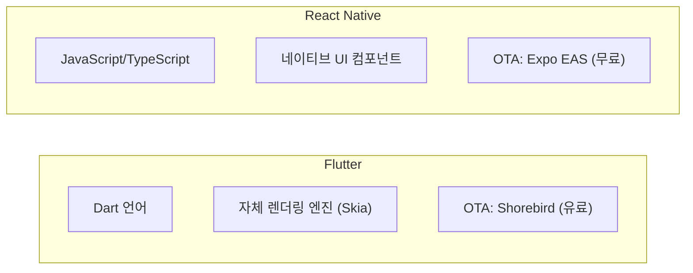

| 항목 | Flutter | React Native |
|------|---------|--------------|
| **언어** | Dart (새로 배워야 함) | JavaScript/TypeScript (웹 개발자 친화적) |
| **렌더링** | 자체 엔진 (Skia) | 네이티브 UI 컴포넌트 |
| **개발사** | Google | Meta (Facebook) |
| **출시** | 2018 | 2015 |
| **OTA 업데이트** | Shorebird (유료/제한적) | **Expo EAS (무료/기본 지원)** |
| **생태계** | Dart 패키지 | **npm 생태계 전체 활용** |

---

## React Native 선택 이유

### 1. 웹 개발자 친화적 생태계

```
JavaScript/TypeScript 기반
→ 웹 개발 경험 그대로 활용
→ React 패턴 그대로 사용 (Hooks, Context, JSX)
→ npm 생태계의 방대한 라이브러리 활용
```

### 2. 네이티브 UI 철학

```
React Native: 플랫폼 네이티브 컴포넌트 사용
→ iOS는 iOS답게, Android는 Android답게
→ 사용자에게 익숙한 UX 제공

Flutter: 자체 렌더링 엔진
→ 모든 플랫폼에서 동일한 UI
→ 플랫폼 느낌이 다를 수 있음
```

### 3. 점진적 도입 용이

```
기존 네이티브 앱에 부분 적용 가능 (Brownfield)
→ 전체 재작성 없이 새 화면만 React Native로 개발
→ 네이티브 모듈 연동이 상대적으로 수월
```

### 4. Expo의 강력한 DX

| 기능 | 설명 |
|------|------|
| **EAS Build** | 클라우드 빌드 (로컬 환경 설정 불필요) |
| **EAS Update** | OTA 업데이트 기본 지원 |
| **Expo Go** | 실기기 테스트 즉시 가능 |
| **Config Plugins** | 네이티브 설정 자동화 |

### 5. 실제 사용 기업

- Meta (Facebook, Instagram, Messenger)
- Microsoft (Outlook, Teams, Xbox)
- Shopify, Discord, Pinterest, Coinbase

---

## OTA 업데이트 - React Native의 킬러 피처

### OTA (Over-The-Air) 업데이트란?

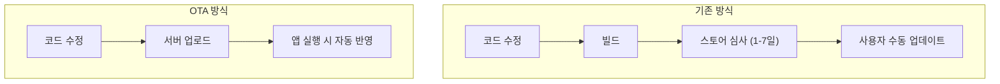

### OTA로 할 수 있는 것 / 없는 것

| OTA 가능 (즉시 배포) | 스토어 심사 필요 |
|---------------------|-----------------|
| UI 변경 (버튼, 색상, 레이아웃) | 새로운 네이티브 라이브러리 추가 |
| 버그 수정 (JS 로직) | 권한 추가 (카메라, 위치 등) |
| 새 화면 추가 | 앱 아이콘/이름 변경 |
| API 연동 변경 | iOS/Android SDK 버전 변경 |

### Flutter와의 OTA 비교

| 항목 | React Native (Expo) | Flutter |
|------|---------------------|---------|
| **기본 지원** | EAS Update 내장 | 미지원 |
| **서드파티** | CodePush (MS) | Shorebird (유료) |
| **설정 난이도** | 간단 (expo 설정만) | 복잡 (네이티브 설정 필요) |
| **비용** | 무료 플랜 있음 | Shorebird 유료 |

### 실제 활용 시나리오

```
긴급 버그 발생!
  ↓
기존 방식: 수정 → 빌드 → 심사 대기 (최소 1-2일)
  ↓
OTA 방식: 수정 → eas update → 즉시 반영 (몇 분)
  ↓
고객 불만 최소화, 빠른 대응 가능!
```

---

# Part 5: SI 프로젝트 적용 가능성

## 1. React Native로 신규 앱 프로젝트 수주 가능

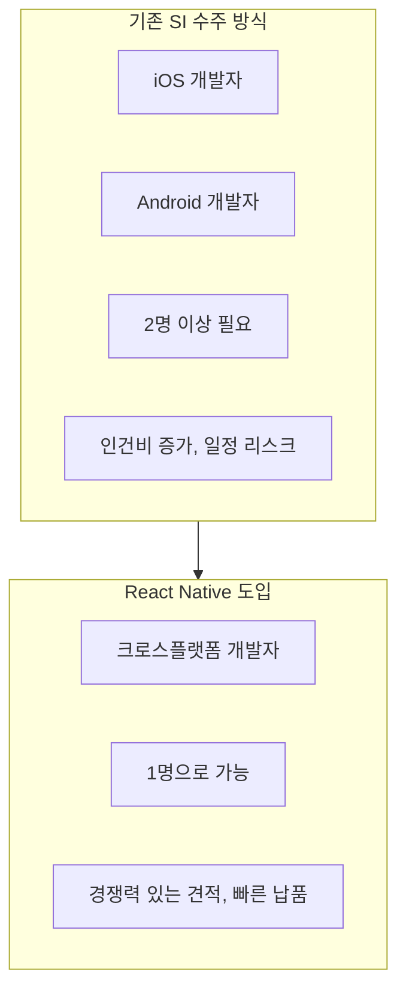

**SI 관점에서의 장점:**
- **견적 경쟁력**: 단일 코드베이스로 인건비 절감
- **납기 단축**: 양 플랫폼 동시 개발로 일정 50% 단축
- **유지보수 효율**: 하나의 코드만 관리
- **OTA 업데이트**: 긴급 버그 수정 즉시 가능

**수주 가능한 프로젝트 유형:**

| 유형 | 예시 |
|------|------|
| 신규 앱 개발 | 고객사 서비스 앱, 사내 업무 앱 |
| 기존 앱 리뉴얼 | 네이티브 → 크로스플랫폼 전환 |
| MVP 빠른 개발 | 스타트업/신사업 PoC |

---

## 2. RAG 기반 AI 프로젝트 수주 가능

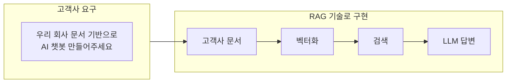

**SI에서 RAG가 강력한 이유:**
- **빠른 구축**: Fine-tuning 없이 문서만 색인하면 끝
- **쉬운 업데이트**: 문서 변경 시 재색인만 하면 됨
- **비용 효율**: 자체 모델 학습 불필요

**수주 가능한 AI 프로젝트:**

| 도메인 | 프로젝트 예시 |
|--------|---------------|
| **금융/보험** | 약관 기반 상담 챗봇 |
| **제조/건설** | 매뉴얼 기반 기술 지원 시스템 |
| **공공기관** | 민원 FAQ 자동 응답 |
| **유통/커머스** | 상품 추천 AI |
| **헬스케어** | 의료 정보 검색 서비스 |

---

## 3. 검증된 기술 역량

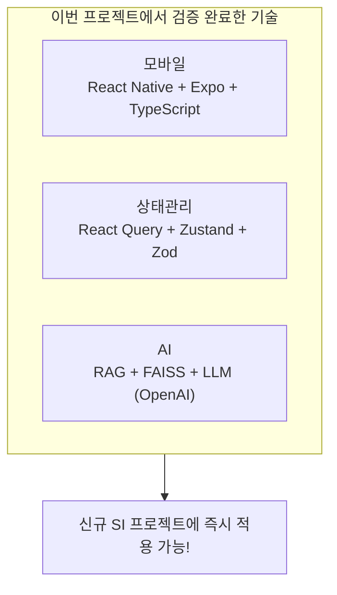

**기술 역량 확보 현황:**
- 크로스플랫폼 앱 개발: **실제 앱스토어/플레이스토어 출시 경험**
- RAG 시스템 구축: **31,000건 문서 기반 서비스 운영 경험**
- 전체 파이프라인: **기획 → 개발 → 배포까지 풀스택 경험**

---

# Part 6: 향후 발전 방향

## 팀 역량 강화 로드맵

### 단기 목표 (3-6개월)
| 목표 | 내용 |
|------|------|
| **RN 역량 확산** | 팀 내 React Native 스터디/세션 진행 |
| **신규 사업 적용** | 차기 앱 프로젝트에 React Native 도입 |
| **RAG 템플릿화** | 재사용 가능한 RAG 보일러플레이트 구축 |

### 중장기 목표 (6-12개월)
| 목표 | 내용 |
|------|------|
| **AI 사업 확대** | RAG 기반 SI 프로젝트 적극 수주 |
| **기술 고도화** | Reranking, Hybrid Search 등 검색 품질 향상 |
| **자체 솔루션** | 문서 기반 AI 챗봇 솔루션 패키지화 |

### 기술 로드맵
| 영역 | 현재 | 목표 |
|------|------|------|
| **Vector DB** | FAISS (파일 기반) | Pinecone/Weaviate (클라우드) |
| **검색** | 단순 유사도 | Reranking + Hybrid Search |
| **LLM** | OpenAI API | Azure OpenAI / 온프레미스 LLM |
| **앱 배포** | 수동 빌드 | EAS + CI/CD 자동화 |

### 기대 효과

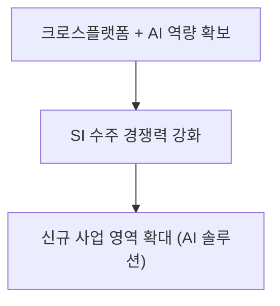

---

# 감사합니다!

## 테스트 환경

- **API**: https://mincha.co.kr/recommend
- **Swagger**: https://mincha.co.kr/docs

## 질문 있으신가요?
